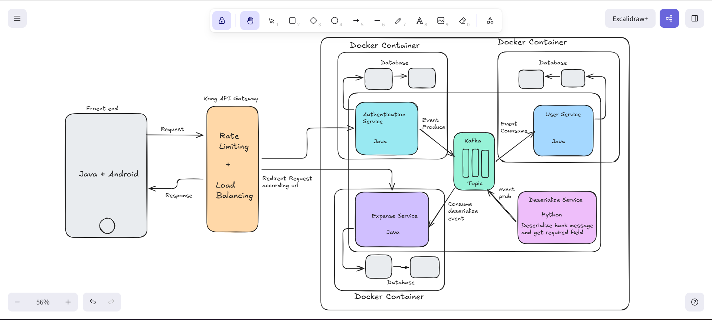

# Expenses-Tracker




# Microservices Event-Driven Architecture

## Overview
This project implements a scalable **event-driven microservices architecture** using API Gateway routing, Kafka messaging, and containerized services. The system is designed to handle authentication, user management, and expense processing while ensuring loose coupling, fault tolerance, and horizontal scalability.

---

## Architecture Components

### 1. API Gateway
Handles all incoming client requests.

**Responsibilities**
- Rate limiting
- Load balancing
- URL-based routing
- Centralized entry point for services

---

### 2. Microservices

#### Authentication Service (Java)
- Handles login, token validation, and authorization.
- Produces events to Kafka after authentication actions.

#### User Service (Java)
- Consumes Kafka events.
- Processes user-related logic.
- Stores data in its dedicated database.

#### Expense Service (Java)
- Consumes processed/deserialized events.
- Performs expense logic and persistence.

#### Deserialize Service (Python)
- Listens to Kafka topic.
- Parses raw bank messages.
- Extracts required fields.
- Publishes cleaned events back to Kafka.

---

### 3. Message Broker
**Kafka Topic**
- Central event streaming backbone.
- Enables asynchronous communication between services.
- Decouples producers and consumers.

---

### 4. Databases
Each service has its **own isolated database** to ensure:
- Data ownership
- Service independence
- Schema flexibility
- Fault isolation

---

### 5. Containers
Each service runs in a dedicated **Docker container**:
- Independent deployment
- Scalability
- Environment consistency
- Easy orchestration

---

## Request Flow

1. Client sends request from frontend.
2. Request is routed to appropriate microservice.
3. Authentication Service validates user.
4. Event is published to Kafka.
5. Deserialize Service processes raw event data.
6. User and Expense services consume events.
7. Services store data in their databases.
8. Response returned to client via API Gateway.

---

## Key Architectural Principles

- Microservices isolation
- Event-driven communication
- Horizontal scalability
- Fault tolerance
- Loose coupling
- Independent deployments

---

## Technology Stack

| Layer       | Technology          |
|-------------|---------------------|
| Gateway     | Kong API Gateway    |
| Services    | Java + Python       |
| Messaging   | Kafka               |
| Containers  | Docker              |
| Databases   | Service-specific DB |

---

## Deployment (Conceptual Steps)

```bash
# build containers
docker build -t auth-service .
docker build -t user-service .
docker build -t expense-service .

# run kafka + services
docker-compose up
